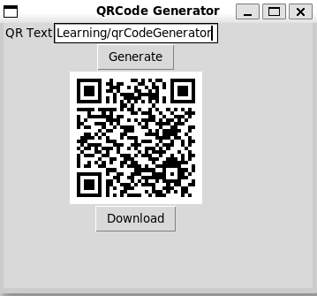

# QRCode Generator App
This is very basic application with the purpose of learning python programing language

App features:
- Generate QRCode from text
- Download generated QRCode image to local file

App's modules:
- Tkinter for GUI 
- [qrcode](https://pypi.org/project/qrcode/) for generating QRCode

